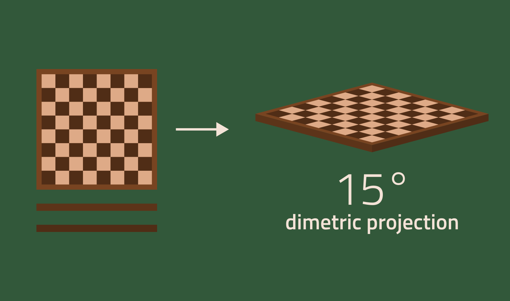
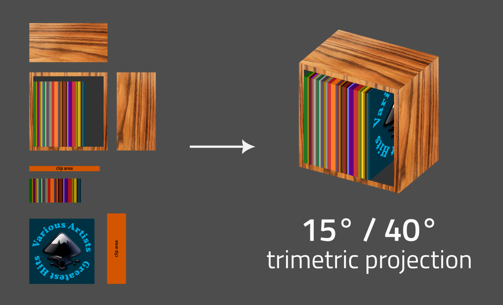
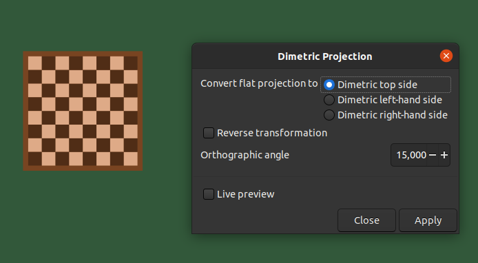

Inkscape extension: isometric projection converter
==================================================

*This version of the extension is for Inkscape `1.2` or newer. For older versions of
Inkscape, please use [v2.1](../../tree/v2.1) (for Inkscape `1.0.*` and `1.1.*`), or
[v1.2](../../tree/v1.2) (for Inkscape versions before `1.0`).*

This [Inkscape](https://inkscape.org) extension transforms objects drawn on a
two-dimensional plane to an isometric or dimetric projection.

Inkscape provides an [axonometric
grid](https://en.wikipedia.org/wiki/Axonometric_projection) that by default is
configured for the [isometric
projection](https://en.wikipedia.org/wiki/Isometric_projection) (i.e., the
three axes are set at 120° angles). Drawing with this grid works quite well for
simple shapes, but sometimes it is easier to draw the details of an object
using a two-dimensional grid, and then scale, shear, and rotate the object to
set it on an isometric plane.

This extension conveniently automates these transformations.

In addition to the isometric projection (a dimetric projection where both angles are 30°), the
extension supports arbitrary angles as well (here the angles are set to 15°). 

This example shows a trimetric projection with two different angles for the left and right hand sides.

## Installation

Copy `isometric_projection.inx`, `dimetric_projection.inx`, and `axonometric_projection.py` to your
Inkscape extensions directory, listed at `Edit » Preferences » System: User extensions`.  After a
restart of Inkscape, the new extension will be available.

## Usage

The extension can now be found in the **Extensions** menu under `Axonometric
Projection`. To convert a flat two-dimensional object
to one of the three visible isometric planes (i.e., top, left-hand side, and
right-hand side), select the object, and perform select the desired conversion
via the `Isometric Projection…` entry from that submenu.

To perform the opposite action (i.e., convert from one of the isometric sides
to a flat two-dimensional object) select the appropiate isometric side, and
enable the *Reverse transformation* option.

For dimetric projections using an angle other than 30°, use `Axonometric Projection » Dimetric
Projection…`, and set the angle to an appropriate value.

For trimetric projections using different angles for the left and right hand sides, use 
`Axonometric Projection » Trimetric Projection…`, and set both angles to appropriate values.

## Further reading

More information about the transformations and maths used by this extension can 
be found in this 
[write-up](http://jeroenhoek.nl/articles/svg-and-isometric-projection.html).
